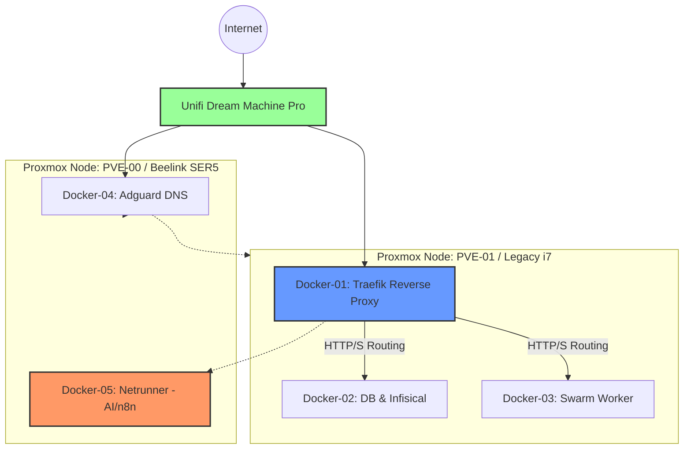

# Hardware & Proxmox Infrastructure

This section documents the physical hardware and the virtualization layer powering the home lab. The environment is currently split between a modern mini-PC and a repurposed high-performance legacy rig, managed via Proxmox VE.
Proxmox Cluster Overview

## Proxmox Compute

The cluster consists of two primary nodes providing compute, storage, and networking for various Dockerized stacks.

### PVE-00: The Vanguard

- Hardware: Beelink SER5 Mini-PC
- CPU: AMD Ryzen 5 5500U (6C/12T)
- Memory: 32GB DDR4
- Storage: 500GB NVMe
- Network: 1Gbps Copper
- Role: Primary high-compute node.
- Workloads:
  - Docker-04: General services.
  - Docker-05: The Netrunner. High-compute node dedicated to LLM and AI traffic.

### PVE-01: The Veteran

- Hardware: Custom Legacy Build
- CPU: Intel Core i7-4770K @ 3.50GHz
- Memory: 28GB DDR3
- Storage:
  - 2x 250GB Samsung 850 EVO SSDs (OS/Fast Storage)
  - 2TB HDD (Bulk Data)
- Network: 1Gbps Copper
- Role: High-availability and swarm support.
- Workloads:
  - Docker-01: Swarm Node.
  - Docker-02: Swarm Node.
  - Docker-03: Swarm Node.

## Networking Infrastructure

The backbone of the lab is handled by Ubiquiti hardware to ensure segmenting and stable throughput for the cluster.

|Device|Model|Connectivity|
|-|-|-|
|Gateway/Router|Unifi Dream Machine Pro (UDM-Pro)|10G SFP+ / 1G RJ45|
|Switching|Integrated UDM-Pro Switch|Nodes connected via 1Gbps Copper|

