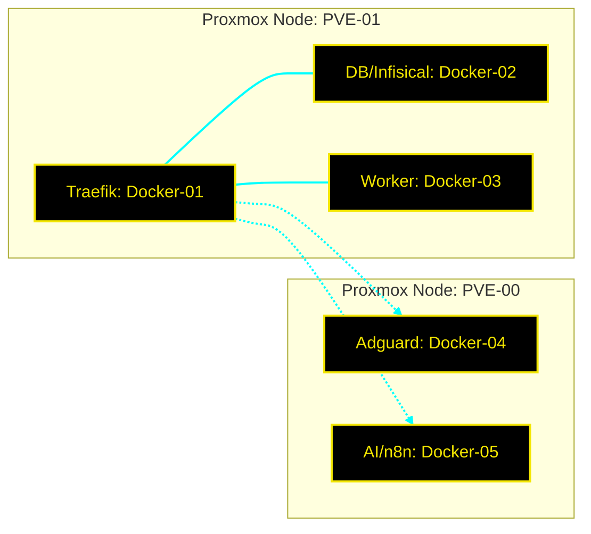

# Hardware place holder

```mermaid
graph LR
    subgraph PVE00 ["Proxmox Node: PVE-00"]
        D04[Adguard: Docker-04]:::yellowNode
        D05[AI/n8n: Docker-05]:::yellowNode
    end

    subgraph PVE01 ["Proxmox Node: PVE-01"]
        D01[Traefik: Docker-01]:::yellowNode
        D02[DB/Infisical: Docker-02]:::yellowNode
        D03[Worker: Docker-03]:::yellowNode
    end

    D01 -.-> D04
    D01 -.-> D05
    D01 --- D02
    D01 --- D03

    classDef yellowNode fill:#000,stroke:#f3e600,stroke-width:2px,color:#f3e600;
    linkStyle default stroke:#00ffff,stroke-width:2px;
```
