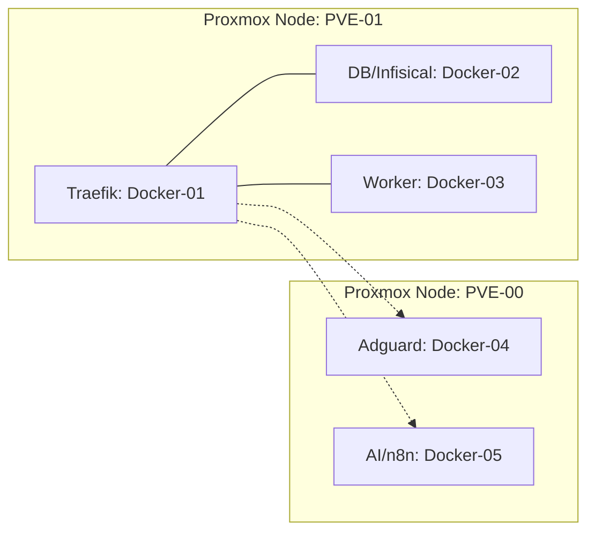

# Hardware place holder

```mermaid
graph LR
    subgraph PVE00 [Proxmox Node: PVE-00]
        D04[Adguard: Docker-04]
        D05[AI/n8n: Docker-05]
    end

    subgraph PVE01 [Proxmox Node: PVE-01]
        D01[Traefik: Docker-01]
        D02[DB/Infisical: Docker-02]
        D03[Worker: Docker-03]
    end

    D01 -.-> D04
    D01 -.-> D05
    D01 --- D02
    D01 --- D03
```
