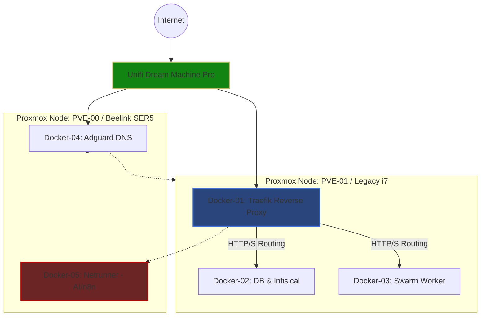

# Networking Infrastructure

Network needs delivered and managed with a Unifi Dream Pro.

|Device|Model|Connectivity|
|-|-|-|
|Gateway/Router|Unifi Dream Machine Pro (UDM-Pro)|1G RJ45|
|Switching|Integrated UDM-Pro Switch|Nodes directly Connected|

